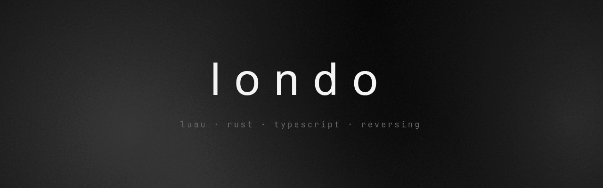

 

I build tools for games — launchers, runtime tooling, and the reverse engineering
that has to happen first. Mostly Windows, mostly at the layer where a program and
the thing it is talking to disagree about what is allowed.

 

### Languages

<table>
<tr>
<td width="140"><b>Luau / Lua</b></td>
<td>My first language and still the one I reach for. Roblox runtime tooling, UI libraries, and reading code that did not want to be read — bytecode, obfuscator output, and the small utilities that make both tractable.</td>
</tr>
<tr>
<td><b>Rust</b></td>
<td>Where the parts that must not lose data live. Binary formats, filesystem work, local HTTP services, Tauri backends.</td>
</tr>
<tr>
<td><b>TypeScript</b></td>
<td>Interfaces. React, Vite, and a real interest in motion — the difference between a page that works and a page that feels built is about four hundred milliseconds.</td>
</tr>
<tr>
<td><b>Python</b></td>
<td>Desktop apps with PySide6, HTTP services with FastAPI, and most of the analysis tooling that never ships anywhere.</td>
</tr>
<tr>
<td><b>C++</b></td>
<td>Native Windows work when nothing above it will do. Direct3D, ImGui, process internals.</td>
</tr>
<tr>
<td><b>Java</b></td>
<td>Minecraft server plugins on Paper.</td>
</tr>
</table>

 

### Also on hand

`Tauri` · `React` · `Vite` · `Motion` · `axum` · `Electron` · `Astro` · `PySide6` · `FastAPI` · `Direct3D 11` · `ImGui` · `Blender` · `Roblox Studio`

Reverse engineering: Lua and Luau bytecode, VM-based obfuscators, binary container
formats, and anti-cheat behaviour — the analysis side of it, so that tooling can
be built against something known rather than guessed at.

 

---

 

### Roundtable

Mod, co-op and save management for ELDEN RING and every other FromSoftware title.

Three things that should be simple are not: running a large overhaul alongside
Seamless Co-op, starting a modded game on a copy that did not come from Steam, and
moving a character between installations that use different account ids. Each has
a known answer, and none of them is one click. This makes them one click.

It reads the `.sl2` save container directly — transferring a character means
rewriting every occurrence of the account id and recomputing the MD5 checksums the
game verifies. It reads ModEngine 2 and me3 configuration, works out which loader
chain will actually start a given installation, and shows you that plan before it
runs it.

The window does not draw the interface. It starts a server on loopback and hands
the address to your browser, then stays alive to serve the folder dialogs a browser
cannot open. Rust and axum underneath, React and Motion on top.

 

---

 

Everything here runs locally. No telemetry, no analytics, no account.

